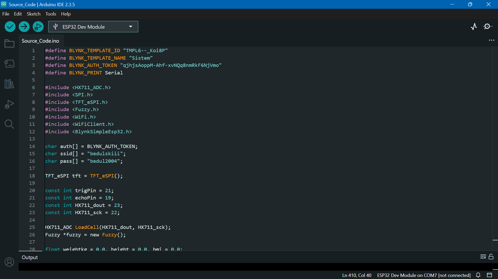
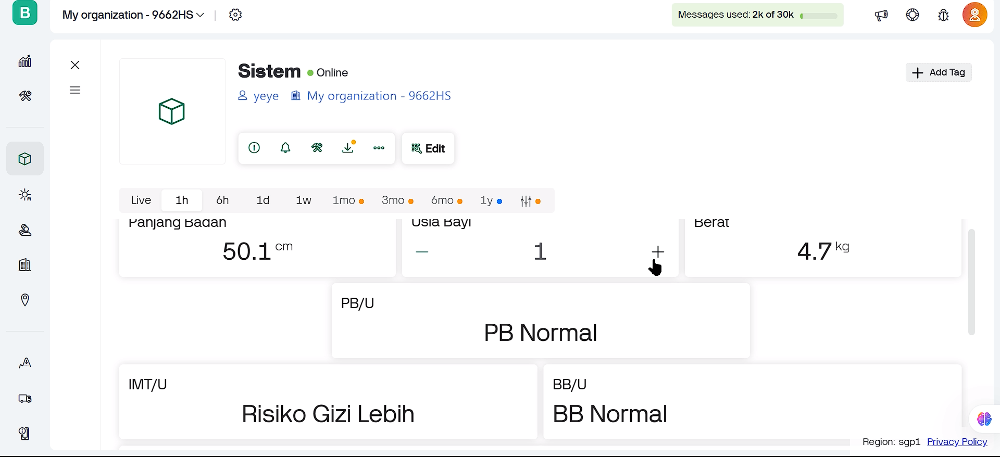

# IoT-Based Automatic Anthropometric System with Fuzzy Logic

## 🧩 Overview

This prototype is an IoT-based infant weighing scale and length measurement device, designed to support early detection of stunting in infants. This device integrates a load cell sensor for weight measurement, an ultrasonic sensor for length measurement, and Blynk platform for real-time data processing and nutritional recommendations using fuzzy logic.

## ✨ Features

- 📊 **Real-time measurement** of baby’s weight and length  
- ☁️ **IoT connectivity** for sending data via Blynk Platform 
- 📱 **Web & Mobile Dashboard integration** for health data display and growth tracking
- 🧠 **Automatic BMI and growth status analysis**  
- 🧾 **Historical data logging** and visualization

## ⚙️ Installation

### 🔧 Requirements

Make sure you have installed:
- [Arduino IDE](https://www.arduino.cc/en/software) (v2.0 or newer)
- [ESP32 board package](https://dl.espressif.com/dl/package_esp32_index.json) (via Boards Manager)
- Required Arduino libraries:
    - HX711_ADC
    - Fuzzy
    - BlynkSimpleEsp32

### 🚀 Steps

1. Clone the repository:
```bash
git clone https://github.com/putrishanty/automatic-anthropometric-system.git
```
2. Open the .ino file in Arduino IDE
3. Replace credentials in the code:
```bash
#define BLYNK_TEMPLATE_ID "YourTemplateID"
#define BLYNK_TEMPLATE_NAME "YourTemplateName"
#define BLYNK_AUTH_TOKEN "YourAuthToken"
const char* ssid = "YourWiFi";
const char* password = "YourPassword";
```
4. Upload the code to your ESP32
5. Open the Blynk mobile app or web dashboard
6. Connect your device and start measuring!



## 🧪 Usage
1. Turn on the device and connect to Wi-Fi.
2. Open the Blynk app or web dashboard.
3. Place the baby gently on the scale surface.
4. The system will:
   - Measure weight and length
   - Send data to Blynk Cloud
   - Allow you to manually input the baby’s age
   - Automatically calculate BMI and growth category
5. View data in real-time from your phone or browser.


